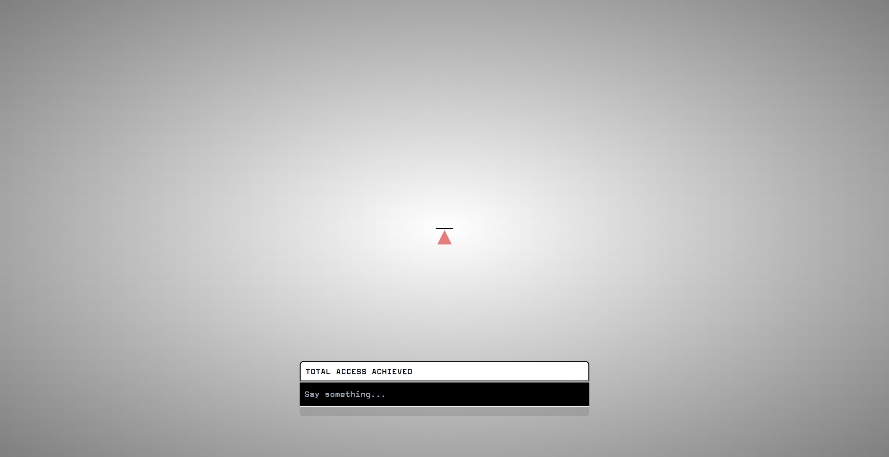

# Samaritan GPT

Samaritan GPT is a proof of concept project inspired by the 'Person of Interest' television show. It is designed to mimic the Samaritan artificial intelligence from the series. The project can be connected to either the OpenAI API or the Ollama API for personal use with model files that help set up the Samaritan character.

## Technologies Used

- Next.js
- Tailwind CSS
- OpenAI api

## Getting Started

To get started with the Samaritan GPT project, follow these steps:

1. Clone the repository: `git clone https://github.com/MrBlackBrain/Samaritan-GPT.git`
2. Install dependencies: `npm install`
3. Start the development server: `npm run dev`
4. Navigate to <http://localhost:3000/> and try saying "Good morning"

## Usage

To use Samaritan GPT, you can connect it to the OpenAI API or the Ollama API by providing the necessary API keys and configuring the API endpoints in the project.

## Contributors

This project was inspired by and built upon the work of [rodrigograca31](https://github.com/rodrigograca31/Samaritan) and [goncalomb](https://github.com/goncalomb/Samaritan).
